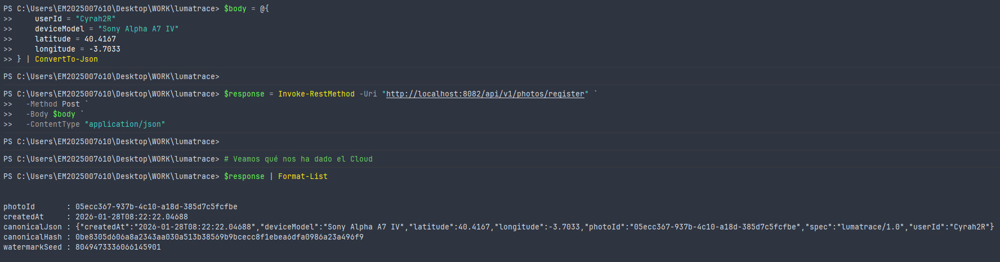
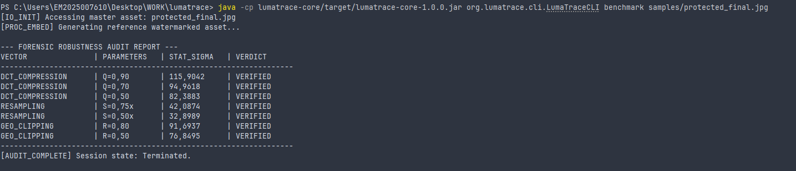

### LumaTrace Enterprise Framework


**LumaTrace** is an invisible and resilient digital watermarking solution designed for intellectual property protection 
in Enterprise environments. It implements Spread-Spectrum algorithms with psycho-visual optimization.

## Modular Architecture

The project follows a multi-module hexagonal architecture managed with Maven:

* **`lumatrace-core`**: The mathematical brain. A pure Java library (no frameworks) containing watermark embedding, 
* detection, and cryptographic key generation algorithms.
* **`lumatrace-cloud`**: The RESTful API. A Spring Boot implementation that exposes the Core as a microservice, manages 
* PostgreSQL persistence, and is containerized with Docker.

## Requirements

* Java JDK 21
* Maven 3.9+
* Docker Desktop (for local deployment)

## Quick Deployment (Docker)

The entire system has been orchestrated to run in containers. Follow these steps to bring up the full infrastructure 
(Database + API) in under one minute.

### 1. Build and Start Everything

From the project root:

```bash
docker-compose up -d --build
```

### 2. Verify Status

Ensure both containers are in the "Up" state:

```bash
docker ps
```

### 3. System Verification (Smoke Test)

Register an image to generate its unique seed (PowerShell):

```powershell
   $body = @{
    userId = "ingeniero_test"
    deviceModel = "Servidor_Cloud"
    latitude = 40.41
    longitude = -3.70
} | ConvertTo-Json

Invoke-RestMethod -Uri "http://localhost:8082/api/v1/photos/register" `
  -Method Post `
  -ContentType "application/json" `
  -Body $body
```

## Visual Fidelity Analysis (JND Validation)

To ensure high-quality content provenance, LumaTrace uses an adaptive spread-spectrum injection. This ensures the watermark is invisible to the human eye while remaining statistically robust for forensic detection.

| Original Asset (`input.jpg`) | Protected Asset (`protected_final.jpg`) | Signal Map (Enhanced Difference) |
| :---: | :---: | :---: |
|  |  |  |
| *No watermark signature* | *Encoded with Seed 8049...* | *Spatial signal distribution* |

[Get the latest executable JARs here](https://github.com/Cyrah2R/lumatrace-cloud/releases/latest)

### Psychovisual Insights
* **Luma Masking:** The signal is heavily masked in high-texture areas (buildings, cars).
* **Sky Protection:** Using `MIN_GAIN = 1.2`, we eliminated grain in low-entropy regions (the sky).
* **Color Constancy:** Injection is balanced across RGB channels to prevent color shifting.

## Technical Validation & Provenance flow

The following end-to-end test demonstrates the binding between Cloud Metadata and the physical asset.

### 1. Cloud Registration (C2PA Manifest)
We registered the asset metadata (Device, GPS, User) via the Cloud API to obtain a unique cryptographic seed.


### 2. Forensic Signal Injection
Using the generated seed `8049473336066145901`, we injected the watermark into `input.jpg`.
* **Latency:** 169 ms
* **Z-Score (σ):** 122.82 (Extreme high confidence)
  

### 3. Robustness Audit (Stress Test)
The asset was subjected to aggressive degradation (JPEG compression, downsampling, and cropping).
* **Survival:** The signal remains verified even at **Q=50** compression and **50% cropping**.
  

## Security Note
The master key and database credentials are managed via the .env file, which is injected into the containers at runtime.
Never hardcode real keys in the source code.

© 2026 LumaTrace Project.**
