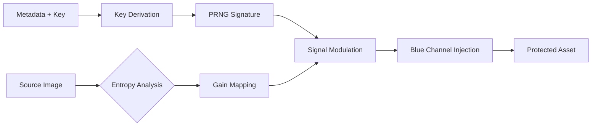

# LumaTrace Core Engine

Standardized implementation of an **Adaptive Spatial Watermarking engine**. Designed to mitigate the "Analog Hole" by embedding persistent, imperceptible identifiers using **Spread-Spectrum modulation** modulated by local image entropy.

---

## Technical Specifications

### Architecture

The engine generates a deterministic pseudo-random noise (PRNG) signature seeded by a cryptographic hash of the metadata and a Master Key.



### Key Differentiators

* **HVS Optimization**: Exploits the Human Visual System's low sensitivity to high-frequency noise in the blue channel.
* **Resilience**: Survives lossy JPEG compression (Q > 50%), bilinear/bicubic rescaling (>0.5x), and center/asymmetric cropping.
* **V3 Performance**: Utilizes Java 21 Virtual Threads and Zero-Allocation buffers for high-throughput batch processing.

### Robustness Benchmarks

Standardized 1080p dataset tests.

| Attack Scenario    | Parameter | Avg. Confidence (σ) | Status | Safety Threshold |
| ------------------ | --------- | ------------------- | ------ | ---------------- |
| Native (No Attack) | 100%      | 37.32               | PASS   | > 4.0            |
| JPEG Compression   | Q=90      | 36.09               | PASS   | > 4.0            |
| JPEG Compression   | Q=70      | 28.50               | PASS   | > 4.0            |
| Rescaling          | 50%       | 16.82               | PASS   | > 4.0            |
| Center Crop        | 80%       | 33.73               | PASS   | > 4.0            |

### CLI Usage

#### Build

Generate the standalone artifact:

```bash
mvn clean package
```

#### Operations

```bash
# Embed watermark
java -jar lumatrace-core.jar embed original.jpg protected.jpg

# Detect watermark
java -jar lumatrace-core.jar detect protected.jpg
```

### Programmatic Integration (Java API)

```java
WatermarkEngine engine = new WatermarkEngine();
WatermarkDetector detector = new WatermarkDetector();

// Embedding process
BufferedImage secured = engine.embedWatermark(img, 0xKEY, "user-id", "content-id");

// Detection process
var result = detector.detect(secured, 0xKEY, "user-id", "content-id");
if (result.detected()) {
    // Confidence Z-Score (Sigma)
    double sigma = result.confidenceZ();
}
```

### Visual Inspection & Forensic Analysis

Since the signal is imperceptible by design (C2PA compliant), use the following methods for manual verification:

#### Layer Subtraction (Difference Map)

* Overlay protected.jpg on original.jpg in any imaging software.
* Set blending mode to Difference. Normalize levels or increase exposure to reveal the underlying Gaussian noise pattern.

#### Blue Channel Frequency Analysis

* The signal resides primarily (~85%) in the blue chrominance.
* Forensic tools will show a structured noise floor in the blue channel that is absent in the source file.

#### Statistical Validation (Sigma Score)

* The engine provides a Z-Score (σ) for every detection.

    * σ = 0.0 → Random noise / No signal
    * σ ≥ 4.0 → Statistical certainty of watermark presence
    * σ ≥ 30.0 → High-energy signal, resilient to aggressive post-processing

LumaTrace Project | C2PA Reference Implementation
