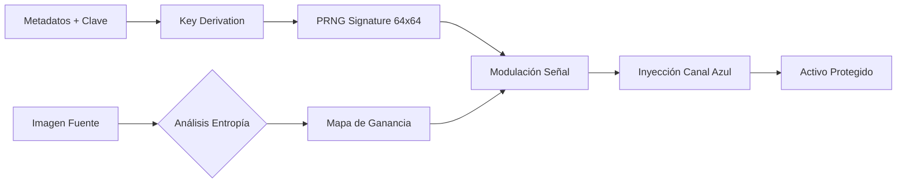

# LumaTrace Core Engine 🛡️


**LumaTrace Core** es la implementación de referencia del motor matemático de **Marca de Agua Espacial Adaptativa**. Esta librería mitiga la vulnerabilidad del "Analog Hole" incrustando identificadores persistentes e invisibles directamente en la señal de la imagen utilizando algoritmos de espectro ensanchado (*Spread-Spectrum*).

## 🧩 Algoritmo y Arquitectura

El motor utiliza un generador de ruido pseudo-aleatorio determinista sembrado por un hash criptográfico de los metadatos y una clave maestra.


    
Características Clave
Invisibilidad: Aprovecha la insensibilidad del Sistema Visual Humano (HVS) al ruido en el canal azul y zonas de alta textura.

Robustez: Sobrevive a compresión JPEG (Calidad > 50%), reescalado (>0.5x) y recorte (Cropping).

Rendimiento V3:

Java 21 Virtual Threads: Procesamiento batch no bloqueante.

Zero-Allocation: Uso de buffers ThreadLocal para evitar presión en el Garbage Collector.

Coarse-to-Fine Search: Detección optimizada mediante búsqueda jerárquica de correlación.

📊 Métricas de Robustez
Pruebas realizadas en dataset estándar (1080p) usando el Benchmark integrado.

Escenario de Ataque	Sigma Promedio (σ)	Veredicto	Umbral Seguro
Nativo (Sin Ataque)	37.32	✅ PASS	> 4.0
Compresión JPEG (Q=90)	36.09	✅ PASS	> 4.0
Compresión JPEG (Q=70)	28.50	✅ PASS	> 4.0
Escalado (50%)	16.82	✅ PASS	> 4.0
Recorte Central (80%)	33.73	✅ PASS	> 4.0

💻 Uso (CLI)
El artefacto se empaqueta como un JAR autónomo.

1. Incrustar (Embed)
```bash
java -jar lumatrace-core.jar embed original.jpg protected.jpg
```

2. Detectar (Detect)
```bash
java -jar lumatrace-core.jar detect protected.jpg
```

Salida:
```
🔍 DETECTION REPORT: protected.jpg
─────────────────────────────
Result:     ✅ WATERMARK DETECTED
Confidence: σ = 36.60
Scale:      1.00x
Time:       142 ms
💪 Strong signal - survives heavy compression
```

3. Configuración
Crea un archivo lumatrace.properties junto al JAR o usa variables de entorno:

# lumatrace.properties
master.key=0xDEADBEEF12345678
default.user=production-user
jpeg.quality=0.95
verbose=false

📦 Integración Programática (Java API)

// 1. Inicializar
WatermarkEngine engine = new WatermarkEngine();
WatermarkDetector detector = new WatermarkDetector();

// 2. Incrustar
BufferedImage secured = engine.embedWatermark(
    originalImage, 
    0xKEY, 
    "usuario-id", 
    "contenido-id"
);

// 3. Detectar
var result = detector.detect(secured, 0xKEY, "usuario-id", "contenido-id");
if (result.detected()) {
    System.out.println("Marca encontrada con confianza: " + result.confidenceZ());
}

Maintained by the LumaTrace Project.