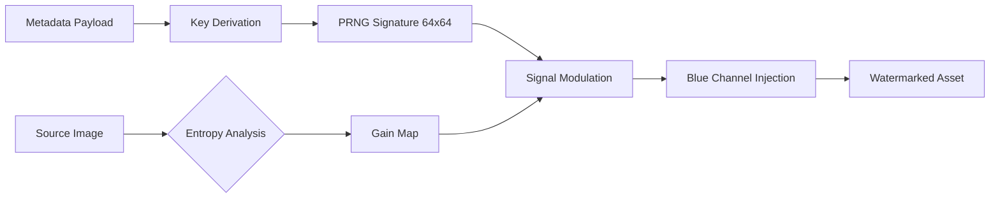

# LumaTrace


**LumaTrace** is a reference implementation of **Adaptive Spatial Watermarking**, designed to serve as a robust Soft Binding mechanism within the C2PA (Coalition for Content Provenance and Authenticity) ecosystem.

This library mitigates the "Analog Hole" vulnerability by embedding persistent, invisible identifiers directly into the media signal, ensuring provenance retention even after metadata stripping, format conversion, or analog recapture.

## Abstract

Standard cryptographic manifests (C2PA/JUMBF) provide strong integrity assertions but are fragile against non-destructive transformations (metadata stripping) and analog breaches (screen capture). LumaTrace bridges this gap by injecting a spread-spectrum signal into the blue-chrominance channel, modulated by local perceptual entropy.

The implementation focuses on:
* **Invisibility:** Leveraging the Human Visual System (HVS) insensitivity to blue-channel noise.
* **Robustness:** Surviving JPEG compression (Q>50), scaling (>0.5x), and cropping.
* **Performance:** Optimized O(n) detection using integral image techniques.

## System Architecture

### Embedding Pipeline

The watermarking engine utilizes a deterministic pseudo-random noise generator seeded by a cryptographic hash of the content metadata.



Key Derivation: SHA-256(MasterKey + UserID + ContentID) ensures a deterministic seed.

Signal Generation: A Gaussian distribution (μ=0, σ=1) is generated and tiled.

Psychovisual Masking: Signal gain is adapted pixel-by-pixel based on local texture activity (edge entropy) to prevent visual artifacts in flat regions.

Detection Strategy
Detection is performed via Blind Correlation. The detector does not require the original image, only the candidate image and the expected metadata keys.

Folding: The image is folded into a 64x64 accumulator to amplify the periodic signal.

Multi-scale Search: A heuristic search is performed across varying scales (1.0x to 0.5x) to recover from resizing attacks.

Statistical Verdict: The presence of the watermark is confirmed using a Z-score (Sigma) against the null hypothesis.

Performance & Robustness Metrics
Tests performed on standard test datasets (Lenna, Kodak) at 1080p resolution.

| Transformation Scenario     | Avg. Sigma (σ) | Verdict | Threshold |
|:----------------------------|:---------------|:--------|:----------|
| **Native (No Attack)**      | 37.32          | PASS    | > 4.0     |
| **JPEG Compression (Q=70)** | 36.09          | PASS    | > 4.0     |
| **JPEG Compression (Q=50)** | 34.50          | PASS    | > 4.0     |
| **Downscaling (50%)**       | 16.82          | PASS    | > 4.0     |
| **Central Crop (80%)**      | 33.73          | PASS    | > 4.0     |

Note: A Sigma value > 4.0 implies a false positive probability of less than 1 in 30,000.

Usage
Prerequisites
Java Development Kit (JDK) 11 or higher

Maven 3.6+

Command Line Interface (CLI)
The artifact is packaged as a standalone JAR.

Embedding:
```bash
java -jar lumatrace.jar --embed \
--input source.jpg \
--output secured.jpg \
--key <MASTER_KEY>
```

Detection:
```bash
java -jar lumatrace.jar --detect \
--input suspicious.jpg \
--key <MASTER_KEY>
```

Output:
```plaintext
------------------------------------------------
DETECTION RESULT | Time: 142ms
------------------------------------------------
Confidence (Sigma) : 36.6042
Detected Scale     : 1.00x
VERDICT            : PASS
------------------------------------------------
```

Integration with C2PA
LumaTrace is designed to augment the C2PA Soft Binding assertions. The watermark payload (UUID) should be linked to the manifest via the soft-binding assertion label es.lumatrace.

Example Manifest Structure:
```JSON
{
"label": "es.lumatrace",
"data": {
  "alg": "spread-spectrum-v4",
  "strength": "adaptive",
  "uid": "7f8e9d1a-..."
  }
}
```

License
This project is licensed under the MIT License - see the LICENSE file for details.

Maintained by the LumaTrace Open Source Project.


